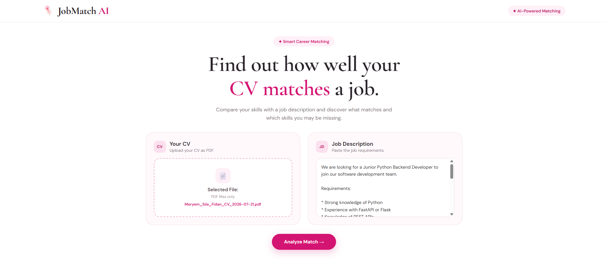
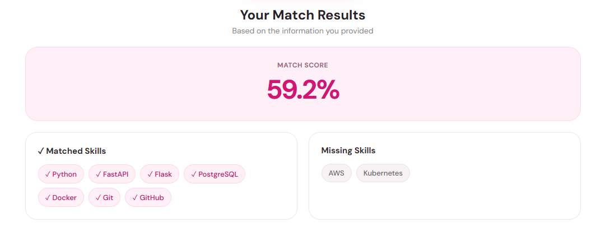

# JobMatch AI





A lightweight AI-powered application that analyzes how well a CV matches a job description and identifies relevant and missing skills.

The application combines **TF-IDF text similarity** with **skill-based analysis** and provides a simple web interface for uploading a CV and entering a job description.

## ✨ Features

* 📄 Upload a CV as a PDF
* 📝 Enter a job description
* 📊 Calculate CV–job similarity score
* 🧠 TF-IDF based text analysis
* 🔗 Cosine similarity calculation
* ✅ Identify matched skills
* ❌ Identify missing skills
* ⚡ FastAPI backend
* 🌐 Simple web-based frontend
* 🔒 CV files are processed locally and are not stored in the repository

## 🖥️ How It Works

The application follows a simple processing pipeline:

```text
CV PDF
  ↓
PDF Text Extraction
  ↓
TF-IDF Vectorization
  ↓
Cosine Similarity
  ↓
Skill Analysis
  ↓
Match Score + Matched Skills + Missing Skills
```

### 1. CV Upload

The user uploads their CV as a PDF through the web interface.

### 2. Job Description

The user enters the job description they want to compare their CV against.

### 3. Text Similarity

The application converts the CV and job description into TF-IDF vectors and calculates their similarity using cosine similarity.

### 4. Skill Analysis

The system analyzes technical skills mentioned in both texts and identifies:

* **Matched Skills:** Skills found in both the CV and job description
* **Missing Skills:** Skills required by the job description but not detected in the CV

### 5. Result

The application returns a match score together with matched and missing skills.

Example:

```text
Match Score: 39.1%

Matched Skills:
- Python
- Docker
- Git

Missing Skills:
- FastAPI
- AWS
- Kubernetes
```

## 🏗️ Project Structure

```text
job-description-matcher/
│
├── app/
│   ├── main.py
│   ├── matcher.py
│   └── skills.py
│
├── frontend/
│   ├── index.html
│   └── pink stickers redbubble _ Pink Jellyfish Sticker.jpg
│
├── data/
│   └── job_description.txt
│
├── requirements.txt
├── README.md
└── .gitignore
```

> Personal CV files are intentionally excluded from Git using `.gitignore`.

## 🛠️ Technologies

* **Python**
* **FastAPI**
* **scikit-learn**
* **TF-IDF**
* **Cosine Similarity**
* **HTML / CSS / JavaScript**
* **REST API**
* **PDF text extraction**

## 🚀 Installation

Clone the repository:

```bash
git clone https://github.com/silafidan/job-description-matcher.git
cd job-description-matcher
```

Create a virtual environment:

```bash
python -m venv venv
```

Activate it on Windows:

```bash
venv\Scripts\activate
```

Install dependencies:

```bash
pip install -r requirements.txt
```

## ▶️ Running the Backend

Start the FastAPI application:

```bash
uvicorn app.main:app --reload
```

The backend will run at:

```text
http://127.0.0.1:8000
```

## 🌐 Running the Frontend

Open:

```text
frontend/index.html
```

in your browser.

Upload a PDF CV, enter a job description, and click **Analyze Match**.

## 📡 API

The main endpoint used by the frontend is:

```text
POST /match-pdf
```

It accepts:

* `file` — CV PDF
* `job_description` — Job description text

Example response:

```json
{
  "filename": "cv.pdf",
  "match_score": 39.1,
  "matched_skills": [
    "Python",
    "Docker",
    "Git"
  ],
  "missing_skills": [
    "FastAPI",
    "AWS",
    "Kubernetes"
  ]
}
```

## 🧪 Current Approach

The current version uses **TF-IDF + cosine similarity** as a lightweight baseline for CV–job matching.

This approach is intentionally simple and provides an interpretable starting point for experimenting with NLP-based document similarity.

## 🔮 Future Improvements

Planned improvements include:

* Semantic similarity using sentence embeddings
* More advanced skill extraction
* Better normalization of technical skills
* Job description parsing
* Job posting URL support
* Improved scoring and ranking
* Job recommendation based on CV compatibility
* Deployment as a web application
* More robust evaluation with real job descriptions

## 🎯 Purpose

This project was developed as a practical NLP and backend project to explore how text similarity techniques can be applied to a real-world recruitment problem.

It also provides hands-on experience with:

* NLP and text similarity
* Python development
* FastAPI API development
* PDF processing
* Frontend–backend integration
* Git and GitHub

## 📌 Project Status

**Active Development**

The current version provides a functional CV–job matching workflow with PDF upload, FastAPI backend, skill analysis, and a web interface.
